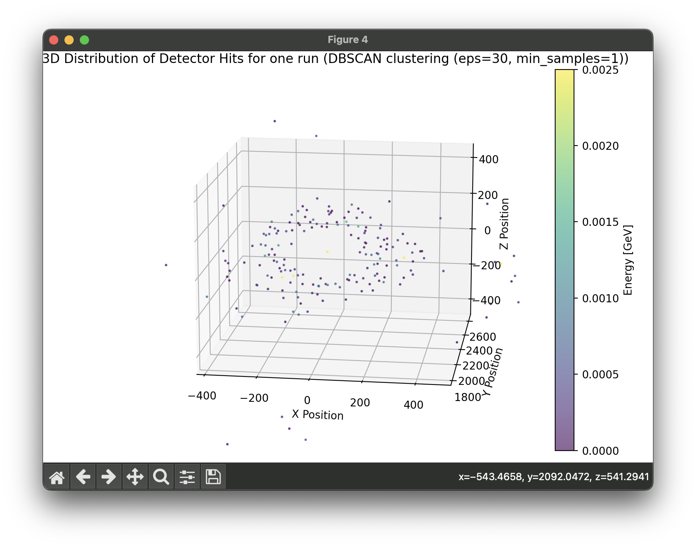

Evaluation task and [short proposal](proposal/proposal.md) of Mattia Micheletta Merlin for GSoC2025 [Geant4-FastSim project](https://hepsoftwarefoundation.org/gsoc/2025/proposal_Geant4-fastsim_representation.html): Data Representation Optimisation for Generative Model-based Fast Calorimeter Shower Simulation

- [Evaluation Task](#evaluation-task)
  - [DDSIM Command](#ddsim-command)
  - [ROOT file analysis](#root-file-analysis)
- [Project proposal](#project-proposal)
  - [Observables](#observables)
  - [Original point cloud](#original-point-cloud)
  - [Grid based](#grid-based)
  - [K-means](#k-means)
  - [4D K-means](#4d-k-means)
  - [Density-based spatial clustering of applications with noise (DBSCAN)](#density-based-spatial-clustering-of-applications-with-noise-dbscan)
  - [Mean shift clustering](#mean-shift-clustering)
  - [Conclusions](#conclusions)

# Evaluation Task
The task of this project was to use the Key4hep framework to simulate some particle showers. In particular, given the geometry of the Future Circular Collider, fire 100 photons from the origin (0, 0, 0), with a direction of (0, 1, 0) and energy of 10 GeV.

## DDSIM Command
After consulting the Key4HEP documentation, I assembled the following command:
```
ddsim --compactFile $K4GEO/FCCee/CLD/compact/CLD_o2_v07/CLD_o2_v07.xml \
  --outputFile myPhotonShowers1100.edm4hep.root \
  --random.seed 42 \
  -G \
  --gun.particle "gamma" \
  --gun.energy "10*GeV" \
  --gun.position "0 0 0" \
  --gun.direction "0 1 0" \
  --numberOfEvents 100
```
that simulates for a hundred times firing a photon in the desired direction with the desired energy. I was not sure if the correct interpretation was this, or to simulate one time 100 photons simultaneously with the arguments `--numberOfEvents 1` and `--gun.multiplicity 100`, ultimately I went with the former.

## ROOT file analysis
This file saves the output in ROOT format, that I analyzed with the python library `uproot` (file `visualize.py`). Among all the branches of the output file, I found the `ECalBarrelCollection/ECalBarrelCollection.energy` branch, which appeared to contain the hit energies in the barrel region of the electromagnetic calorimeter. Here is a histogram of these energies

And I calculated:
```
energy mean: 0.718140 MeV, standard deviation: 0.001408
```

# Project proposal
> explore different approaches to clustering these individual simulated hits into a point cloud, seeking to minimise the number of points while preserving key calorimetric observables.
> Propose different approaches to clustering, with justification

Firstly I started thinking and reading online about clustering algorithms, I found some interesting, and then I tried to apply them on some real data. Which data? From what I understood the goal is to cluster the very numerous `Geant4` steps, into a point cloud that is still more granular than the readout geometry. Sadly I couldn't find any such steps in the `.edm4hep.root` output file, so I applied the clustering algorithms on the data found in `ECalBarrelCollection/ECalBarrelCollection.position.x` `y` and `z`, that are the positions of the readout cells being hit in the electromagnetic calorimeter, with `ECalBarrelCollection/ECalBarrelCollection.energy` containing the energy of each hit.

All the strategies I am about to discuss now are implemented in the file `cluster.py`, and are tested by clustering the hits from the first of the hundred simulated photons.

## Observables
In order to compare the clustered pointclouds to the original point cloud of hits, beside looking at the 3d plot, I utilized some calorimetric observables:
- Energy mean: mean energy of the hits
- Energy standard deviation
- Baricenter of the shower: baricenter weighted by the energy of each hit
- Weighted root mean square (RMS) distance: a way to calculate the "average distance" from the baricenter. It's calculated as $\sqrt{( \sum e_i d_i^2 )/ \sum e_i}$ where $e_i$ is the energy of a hit and $d_i$ is the distance from the barycenter

Here are the observables of the methods I am about to describe:

|Strategy         | Number of points | Energy Mean (GeV) |    Std Dev |        RMS |    Baricenter X |    Baricenter Y |    Baricenter Z |         Total Energy
|-|-|-|-|-|-|-|-|-|
|Original                       |    345 |           0.00077 |    0.00166 |  133.13126 |       -0.257999 |     2243.794189 |       -0.401835 |         0.2642005865|
|Grouped by 10x10x10 cubes      |    167 |           0.00158 |    0.00527 |  133.06921 |       -0.193847 |     2243.912598 |       -0.171198 |         0.2642005846|
|Grouped by 20x20x20 cubes      |     76 |           0.00348 |    0.01241 |  132.89634 |       -0.026343 |     2244.037598 |       -0.683550 |         0.2642005820|
|K-means clustering             |    150 |           0.00176 |    0.00342 |  133.12759 |       -0.146462 |     2243.828717 |       -0.058967 |         0.2642005865|
|K-means clustering 4D          |    150 |           0.00069 |    0.00141 |  207.80686 |       -1.199857 |     2239.840010 |       -0.128956 |         0.1040864785|
|MeanShift clustering (sklearn) |     16 |           0.01651 |    0.05453 |  132.59293 |       -3.513592 |     2245.787412 |        1.048856 |         0.2642005865|
|DBSCAN clustering (eps=30, min_samples=1) |     14 |           0.01887 |    0.06691 |  129.73541 |       -1.123806 |     2258.188721 |       -1.037853 |         0.2642005889|

## Original point cloud
To have a reference, here is a 3d scatter plot of the original pointcloud that I am about to cluster:

These are all the hits originated from the first of the hundred photons.

## Grid based
The simplest approach I came up with is dividing the space into a 10mm grid, and represent all the hits in a cell as a single hit with energy equal to their sum, and position equal to their barycenter.


In this case this approach halves the number of total points used and preserves the total energy and the overall shape of the shower, really good. Some negative aspects could be that the energy mean is higher, from 0.77 MeV to 1.58 MeV

I tried also with a bigger grid size, 20 mm, that further halves the number of points, and logically further doubles the average energy.


## K-means
[This](https://en.wikipedia.org/wiki/K-means_clustering) simple but effective algorithm defines some centroids (we can choose how many) and lets them converge on the input points. I made it to cluster based on the positions of the hits, and then assigned as energy of the centroid the sum of the energy of the single hits. I set 150 centroids.


As the above, it preserves the total energy, but this implies that since the number of points is halved, the average energy per hit is doubled. Similarly to the above method, the shape of the shower is well conserved

## 4D K-means
Instead of centering on the position, I let the algorithm work on 4 dimensional data points, three for the position and one for the energy


As we can see from the observables, the average energy of hits is conserved, but the total energy of the shower is halved. Also we can see from the RMS and the graph that the shower is more spread out.

## Density-based spatial clustering of applications with noise (DBSCAN)
Another interesting [algorithm](https://en.wikipedia.org/wiki/DBSCAN) i read about, but gave strange non promising results:

This representation totally loses the geometrical shape of the shower. Trying to cluster with DBSCAN on more data gives results like this:

So it seems that all the high energy events in the beam direction "suck toghether" all the smaller events near them.

## Mean shift clustering
I tried exploring also [this](https://en.wikipedia.org/wiki/Mean_shift#Clustering) algorithm but similarly to DBSCAN it completely destroyed the shape of the shower, clustering in too few points


## Conclusions
In conclusion, it seems that the most adapt algorithms for this task are the grid based and the K-means clustering. The grid based is the simplest and most effective, but the K-means clustering is more flexible and can be used to cluster in 4D space, which could be useful in some cases. The DBSCAN and Mean shift clustering algorithms seem to not suitable for this task, as they tend to cluster in too few points, and lose the shape of the shower.